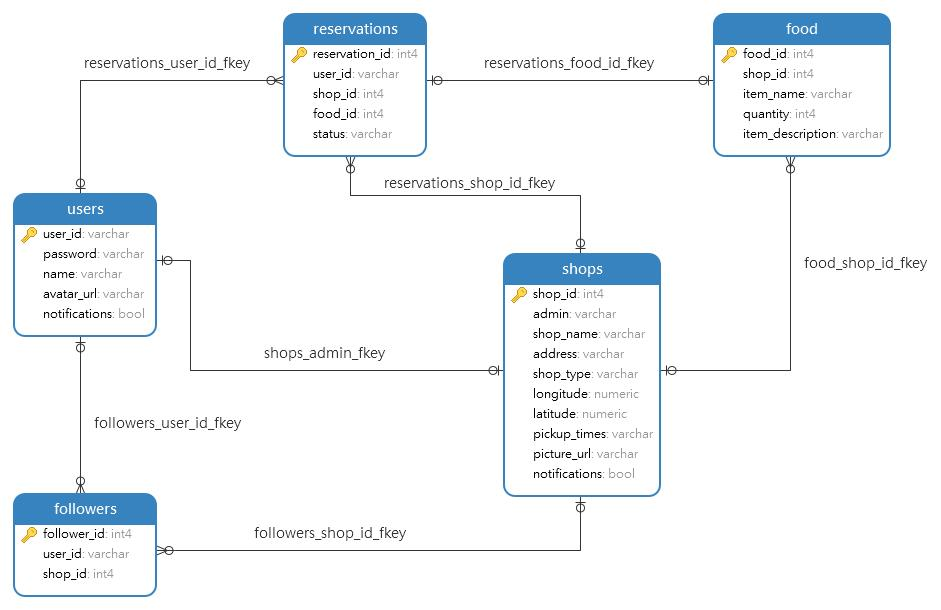

# eatBay database API

This is the API for accessing application data programmatically from the eatBay PostgreSQL database. The API is used by the eatBay mobile application (see: [https://github.com/keithbeacham/eat-Bay](https://github.com/keithbeacham/eat-Bay) ) 

## Database table structure and relationships

The database consists of five tables: users, shops, food, reservations, and followers. The table structure and relationships between the tables is shown below.

## API endpoints

- GET /api
- GET /api/shops
- GET /api/food
- GET /api/food/:food_id
- GET /api/shops/:shop_id/food
- GET /api/users/:user_id
- GET /api/shops/:shop_id
- GET /api/shops/:shop_id/reservations
- GET /api/users/:user_id/reservations
- GET /api/shops/:shop_id/followers
- POST /api/users
- POST /api/shops
- POST /api/shops/:shop_id/food
- POST /api/reservations
- POST /api/shops/followers
- PATCH /api/food/:food_id/update_quantity
- PATCH /api/reservations/:reservation_id
- DELETE /api/food/:food_id
- DELETE /api/shops/:shop_id/:user_id/followers
- DELETE /api/reservations/:reservation_id

## Hosted version of API

A hosted version of the API is available at [https://eatbay-be.onrender.com](https://eatbay.onrender.com). The API is hosted on Render, and the database is hosted on ElephantSQL. A list of all available endpoints and their details can be obtained at `/api`.

## Setup required to run locally

- Node.js (v21.6.0 or above) and PostgresQL (v14.11 or above).
- Clone this repository to your local machine using the URL [https://github.com/marcusyoung/eatbay-be.git](https://github.com/marcusyoung/eatbay-be.git).
- Run `npm -i` to install any dependencies.
- Create .env files to hold the test and development database names (see below for further details).
- Create the local database by running `npm run setup-dbs`.

### Defining environment variables

Two files: `.env.test` and `.env.development` must be created at the top level of the file structure. These should define the environment variable `PGDATABASE` for the test and development database respectively. Set `PGDATABASE` to equal the name used for the relevant database in your local setup. The two files should be git ignored. 

It is assumed that the password to connect to your PostgreSQL database has been saved to a .pgpass file in your home folder. If not, you may need to define additional environment variables in the .env files.

## Running tests

- To run integration tests use: `npm test app`

When running the integration tests, the test database will be seeded with the test data prior to each test being run.